  

  <picture>
    <source media="(prefers-color-scheme: dark)"  srcset="https://readme-typing-svg.demolab.com?font=Share+Tech+Mono&weight=500&size=16&duration=2200&pause=1400&color=C9184A&center=true&vCenter=true&width=620&lines=Building+AI-powered+backends...;Wiring+RAG+pipelines+with+FastAPI...;Low-level+C+to+cloud-scale+Python...;1337+%E2%86%92+YouCode+UM6P+%E2%86%92+production_" />
    <source media="(prefers-color-scheme: light)" srcset="https://readme-typing-svg.demolab.com?font=Share+Tech+Mono&weight=500&size=16&duration=2200&pause=1400&color=A4133C&center=true&vCenter=true&width=620&lines=Building+AI-powered+backends...;Wiring+RAG+pipelines+with+FastAPI...;Low-level+C+to+cloud-scale+Python...;1337+%E2%86%92+YouCode+UM6P+%E2%86%92+production_" />
     YouCode UM6P -> production." width="100%" />
  </picture>

  

  <picture>
    <source media="(prefers-color-scheme: dark)"  srcset="https://readme-typing-svg.demolab.com?font=Share+Tech+Mono&size=14&duration=1&pause=99999&color=A4133C&center=true&vCenter=true&repeat=false&width=780&lines=%E2%94%80%E2%94%80%E2%94%80%E2%94%80%E2%94%80%E2%94%80%E2%94%80%E2%94%80%E2%94%80%E2%94%80+%3A%3A+TECH+STACK+%3A%3A+%E2%94%80%E2%94%80%E2%94%80%E2%94%80%E2%94%80%E2%94%80%E2%94%80%E2%94%80%E2%94%80%E2%94%80" />
    <source media="(prefers-color-scheme: light)" srcset="https://readme-typing-svg.demolab.com?font=Share+Tech+Mono&size=14&duration=1&pause=99999&color=A4133C&center=true&vCenter=true&repeat=false&width=780&lines=%E2%94%80%E2%94%80%E2%94%80%E2%94%80%E2%94%80%E2%94%80%E2%94%80%E2%94%80%E2%94%80%E2%94%80+%3A%3A+TECH+STACK+%3A%3A+%E2%94%80%E2%94%80%E2%94%80%E2%94%80%E2%94%80%E2%94%80%E2%94%80%E2%94%80%E2%94%80%E2%94%80" />
    
  </picture>

<table width="100%" cellspacing="0" cellpadding="6">
<tr>
<td width="33%" valign="top" align="center">
  

</td>
<td width="33%" valign="top" align="center">
  

</td>
<td width="33%" valign="top" align="center">
  

</td>
</tr>
</table>

<table width="100%" cellspacing="0" cellpadding="6">
<tr>
<td width="33%" valign="top" align="center">
  

</td>
<td width="33%" valign="top" align="center">
  

</td>
<td width="33%" valign="top" align="center">
  

</td>
</tr>
</table>

  <picture>
    <source media="(prefers-color-scheme: dark)"  srcset="https://readme-typing-svg.demolab.com?font=Share+Tech+Mono&size=14&duration=1&pause=99999&color=A4133C&center=true&vCenter=true&repeat=false&width=780&lines=%E2%94%80%E2%94%80%E2%94%80%E2%94%80%E2%94%80%E2%94%80%E2%94%80%E2%94%80%E2%94%80%E2%94%80+%3A%3A+PINNED+PROJECTS+%3A%3A+%E2%94%80%E2%94%80%E2%94%80%E2%94%80%E2%94%80%E2%94%80%E2%94%80%E2%94%80%E2%94%80%E2%94%80" />
    <source media="(prefers-color-scheme: light)" srcset="https://readme-typing-svg.demolab.com?font=Share+Tech+Mono&size=14&duration=1&pause=99999&color=A4133C&center=true&vCenter=true&repeat=false&width=780&lines=%E2%94%80%E2%94%80%E2%94%80%E2%94%80%E2%94%80%E2%94%80%E2%94%80%E2%94%80%E2%94%80%E2%94%80+%3A%3A+PINNED+PROJECTS+%3A%3A+%E2%94%80%E2%94%80%E2%94%80%E2%94%80%E2%94%80%E2%94%80%E2%94%80%E2%94%80%E2%94%80%E2%94%80" />
    
  </picture>

  
  

  <picture>
    <source media="(prefers-color-scheme: dark)"  srcset="https://readme-typing-svg.demolab.com?font=Share+Tech+Mono&size=14&duration=1&pause=99999&color=A4133C&center=true&vCenter=true&repeat=false&width=780&lines=%E2%94%80%E2%94%80%E2%94%80%E2%94%80%E2%94%80%E2%94%80%E2%94%80%E2%94%80%E2%94%80%E2%94%80+%3A%3A+GITHUB+METRICS+%3A%3A+%E2%94%80%E2%94%80%E2%94%80%E2%94%80%E2%94%80%E2%94%80%E2%94%80%E2%94%80%E2%94%80%E2%94%80" />
    <source media="(prefers-color-scheme: light)" srcset="https://readme-typing-svg.demolab.com?font=Share+Tech+Mono&size=14&duration=1&pause=99999&color=A4133C&center=true&vCenter=true&repeat=false&width=780&lines=%E2%94%80%E2%94%80%E2%94%80%E2%94%80%E2%94%80%E2%94%80%E2%94%80%E2%94%80%E2%94%80%E2%94%80+%3A%3A+GITHUB+METRICS+%3A%3A+%E2%94%80%E2%94%80%E2%94%80%E2%94%80%E2%94%80%E2%94%80%E2%94%80%E2%94%80%E2%94%80%E2%94%80" />
    
  </picture>

<table width="100%" cellspacing="0" cellpadding="6">
<tr>
<td width="45%" valign="top" align="center">
<picture><source media="(prefers-color-scheme: dark)" srcset="https://streak-stats.demolab.com?user=adamaarbouba&background=1A1A1A&border=A4133C&stroke=A4133C&ring=FF4D6D&fire=A4133C&currStreakNum=FF4D6D&sideNums=FF4D6D&currStreakLabel=C9184A&sideLabels=C9184A&dates=666666&hide_border=false" /><source media="(prefers-color-scheme: light)" srcset="https://streak-stats.demolab.com?user=adamaarbouba&background=FFF0F3&border=A4133C&stroke=A4133C&ring=C9184A&fire=A4133C&currStreakNum=590D22&sideNums=590D22&currStreakLabel=A4133C&sideLabels=A4133C&dates=C9184A&hide_border=false" /></picture>
</td>
<td width="55%" valign="top" align="center">
<picture><source media="(prefers-color-scheme: dark)" srcset="https://github-readme-activity-graph.vercel.app/graph?username=adamaarbouba&bg_color=1A1A1A&color=C9184A&line=FF4D6D&point=A4133C&area=true&area_color=A4133C&hide_border=false&border_color=A4133C44&radius=4" /><source media="(prefers-color-scheme: light)" srcset="https://github-readme-activity-graph.vercel.app/graph?username=adamaarbouba&bg_color=FFF0F3&color=A4133C&line=C9184A&point=A4133C&area=true&area_color=C9184A&hide_border=false&border_color=A4133C44&radius=4" /></picture>
</td>
</tr>
</table>

  <picture>
    <source media="(prefers-color-scheme: dark)"  srcset="https://readme-typing-svg.demolab.com?font=Share+Tech+Mono&size=14&duration=1&pause=99999&color=A4133C&center=true&vCenter=true&repeat=false&width=780&lines=%E2%94%80%E2%94%80%E2%94%80%E2%94%80%E2%94%80%E2%94%80%E2%94%80%E2%94%80%E2%94%80%E2%94%80+%3A%3A+CONNECT+%3A%3A+%E2%94%80%E2%94%80%E2%94%80%E2%94%80%E2%94%80%E2%94%80%E2%94%80%E2%94%80%E2%94%80%E2%94%80" />
    <source media="(prefers-color-scheme: light)" srcset="https://readme-typing-svg.demolab.com?font=Share+Tech+Mono&size=14&duration=1&pause=99999&color=A4133C&center=true&vCenter=true&repeat=false&width=780&lines=%E2%94%80%E2%94%80%E2%94%80%E2%94%80%E2%94%80%E2%94%80%E2%94%80%E2%94%80%E2%94%80%E2%94%80+%3A%3A+CONNECT+%3A%3A+%E2%94%80%E2%94%80%E2%94%80%E2%94%80%E2%94%80%E2%94%80%E2%94%80%E2%94%80%E2%94%80%E2%94%80" />
    
  </picture>

  
  &nbsp;
  
  &nbsp;
  

  
  &nbsp;
  
  &nbsp;
  

  

